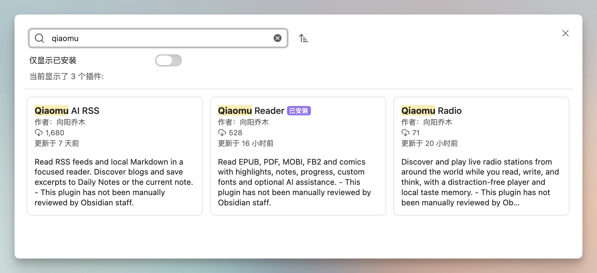
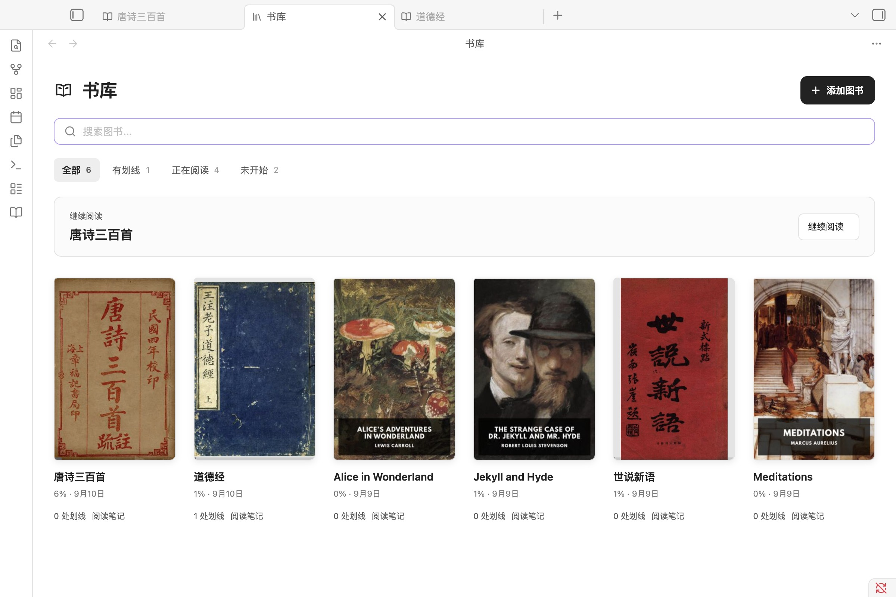
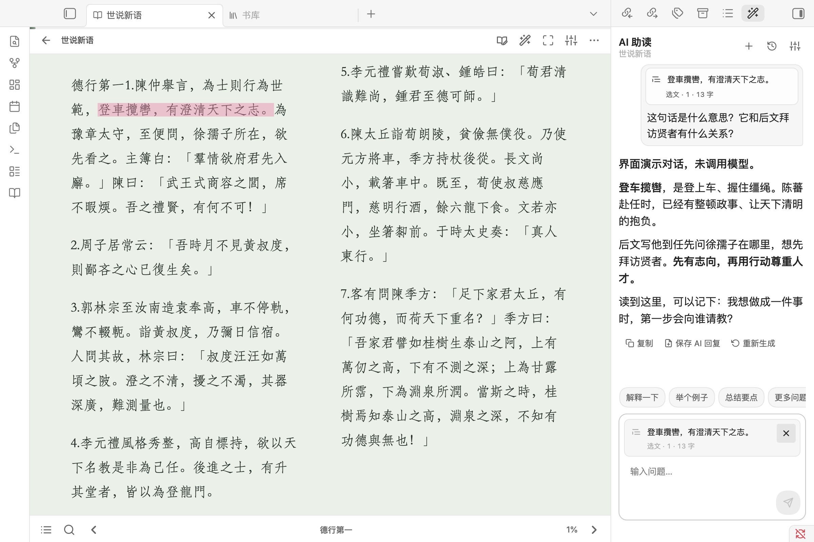

# qiaomu-obsidian-dev

> AI 会写 Obsidian 插件代码，但“能编译”离“用户敢安装”还差很远。

**qiaomu-obsidian-dev 让 Codex、Claude Code 等 Agent 按真实产品标准开发 Obsidian 插件：先研究官方 API 和同类开源项目，先判断值不值得做，再完成架构、开发、真实 Vault 验证与发布闭环。**

[](https://github.com/joeseesun/qiaomu-obsidian-dev) [](https://github.com/joeseesun/qiaomu-obsidian-dev/stargazers) [](https://github.com/joeseesun/qiaomu-obsidian-dev/commits/main) [](LICENSE)

```bash
npx skills add joeseesun/qiaomu-obsidian-dev
```

装完后直接对 Agent 说：

> 开发一个 Obsidian 插件。先查官方 API 和 GitHub 同类开源项目，给我差异化评估与推荐方案，通过后再开发和验证。



这不是一份只会提醒你“注意代码质量”的提示词。下面三款真实插件的开发和持续迭代，都使用了这套方法沉淀出的架构、交互、性能与发布门禁。

## 为什么值得安装

| 普通 AI 开发容易停在 | 使用这个 Skill 后 |
| --- | --- |
| 想到功能就开始写，最后才发现已有成熟插件 | 先查 Obsidian 官方文档、API、示例和 GitHub 同类开源项目 |
| 只比较功能列表，不看许可证和源码 | 对比许可、维护状态、架构、移动端、生命周期、测试与可复用部分 |
| `npm run build` 通过就说“完成” | 安装进明确的测试 Vault，重载插件，用真实 fixture 和真实交互验收 |
| 异步结果覆盖新状态、重载后重复监听、内存持续增长 | 先确定状态所有者、请求代次、资源释放、恢复路径和性能预算 |
| GitHub Release 存在就说“已上架” | 分开验证 PR、CI、Release、公开资产、官方目录和客户端安装状态 |

## 已经用它开发和迭代了什么

### Qiaomu Reader

**把电子书、AI 辅助阅读、划线和笔记都留在 Obsidian。**

支持 EPUB、PDF、MOBI、FB2、漫画等常见格式；可建立书库、记录阅读进度、划线批注，并让 AI 围绕当前书籍或选中文本继续讨论。适合希望在一个知识库里完成沉浸阅读、思考与沉淀的人。

[查看 Qiaomu Reader →](https://github.com/joeseesun/qiaomu-reader)

<p align="center">
  
  
</p>

### Qiaomu AI RSS

**不离开 Obsidian，直接阅读中文化的一手 AI 信息。**

内置我长期收藏整理的 46 个海外 AI 信息源，并可继续订阅约 1,500 个独立博客或其他 RSS。文章可以在沉浸式阅读器中阅读、收藏，并把重要内容保存进当前笔记或 Daily Notes。

[查看 Qiaomu AI RSS →](https://github.com/joeseesun/qiaomu-ai-rss)


### Qiaomu Radio

**在 Obsidian 里收听全球 5 万多个电台，让阅读、写作和学习不再只有安静。**

可探索全球直播电台，播放音乐、谈话节目和自然白噪音；播放器保持克制，不打断当前笔记和学习流程。

[查看 Qiaomu Radio →](https://github.com/joeseesun/qiaomu-radio)

## 它会怎样帮你开发新插件

### 1. 先研究，再决定要不要写

新插件或重大能力开始前，Agent 会先建立可追溯的研究基线：

1. 查当前 Obsidian 官方文档、API、示例和开发政策。
2. 搜索功能相近且仍在维护的 GitHub 开源插件，固定到具体 commit 阅读源码。
3. 比较许可证、维护状态、架构、功能重叠、移动端边界和可复用部分。
4. 先给出机会判断、MVP、风险、验证计划，以及 **Go / Revise / Stop / Contribute** 结论。

你能在投入开发之前知道：该原创、该复用、该贡献上游，还是根本不值得做。

### 2. 按插件类型选择正确架构

Skill 覆盖八类常见 Obsidian 插件：

- 命令与自动化
- 编辑器增强与 CodeMirror 6 扩展
- 自定义视图、面板与工作区插件
- 数据、索引与搜索
- 导入、导出与格式转换
- 网络、同步与发布
- 媒体、阅读与学习
- AI、Agent 与外部服务集成

它不会把 Reader、RSS 或 Radio 的产品形态强塞给其他插件，而是先识别核心动作、权威状态、生命周期、副作用、恢复方式、平台边界和证据要求。

### 3. 把“完成”变成可以验证的证据

默认交付链路：

```text
官方与开源调研 → 机会评估 → 架构与 MVP → 最小实现
→ 自动检查 → 安装到测试 Vault → 重载与真实交互
→ PR / CI → Release 资产 → 公开安装回读
```

构建通过、真实 Obsidian 可用、GitHub 已发布、官方目录已收录，是四种不同状态。Skill 会明确告诉你已经验证到哪一步，不用模糊的“应该可以”。

## 你可以直接这样说

- “开发一个把当前笔记属性同步到任务服务的插件，先调研官方 API 和相似开源项目，再给评估方案。”
- “做一个 Obsidian 日历视图，先判断状态归谁、索引怎么更新、重载后怎么恢复，再开始写。”
- “修复这个 CM6 插件输入中文后装饰错位，并验证撤销、长文、Live Preview 和移动端边界。”
- “审查插件为什么本地能装但社区目录搜不到，分别核对 Release、公开资产、官方审核和客户端状态。”
- “这个 PDF 插件打开大文件内存一直涨，先复现和测量，不要只改一个阈值。”

## 安装

### 一行安装

```bash
npx skills add joeseesun/qiaomu-obsidian-dev
```

### 安装前确认

- [ ] 已安装 Node.js LTS；运行 `node --version` 和 `npx --version` 能看到版本号。
- [ ] 使用支持 Agent Skills 的 Codex、Claude Code、Cursor、OpenCode 或兼容工具。
- [ ] 开发插件时准备一个独立测试 Vault，不把自己的真实日记当测试夹具。
- [ ] 发布工作需要 Git 与 GitHub CLI；运行 `git --version`、`gh auth status` 检查。

### 验证 Agent 能发现 Skill

```bash
npx skills add joeseesun/qiaomu-obsidian-dev --list
```

输出中应出现 `qiaomu-obsidian-dev`。

## 自带的发布审计工具

仓库包含几个只读检查脚本，可独立用于现有 Obsidian 插件：

```bash
python3 scripts/validate_skill.py .
python3 scripts/audit_release.py /path/to/plugin --tag 1.2.3 --max-asset-bytes 5000000
python3 scripts/audit_release.py /path/to/plugin --tag 1.2.3 --compare-dir /tmp/downloaded-release
python3 scripts/check_public_release.py /path/to/plugin --repo owner/repo --version 1.2.3 --attempts 6
```

它们可以检查版本链、构建资产、文件大小、字节级差异、SHA-256 和公开 Release 可安装性，但不会扫描或上传用户笔记，也不会执行目标项目。

## 边界

- 这是 Agent Skill，不是 Obsidian 插件；安装后由 Agent 在开发任务中调用。
- 它不会自动证明插件兼容所有设备；移动端仍需真机验证。
- 它不会把 GitHub Release、官方审核和社区插件上架混成同一件事。
- 联网 API、模型、账号与付费能力必须使用真实服务单独验收。
- 局部 bug、文档和纯样式修改不会强制重做完整竞品调研，除非出现未知 API 或架构问题。

## Troubleshooting

| 问题 | 解决方法 |
| --- | --- |
| `npx skills` 找不到 Skill | 确认仓库根目录存在 `SKILL.md`，再运行 `npx skills add joeseesun/qiaomu-obsidian-dev --list` |
| Agent 没有自动使用 | 在任务中明确说“使用 qiaomu-obsidian-dev 开发/审查这个 Obsidian 插件” |
| 本地构建通过，真实 Obsidian 仍有问题 | 核对当前 checkout、插件安装目录、测试 Vault、插件版本和 fixture，然后重载正确 Vault |
| Release 存在但客户端无法安装 | 匿名请求精确版本资产，确认 `main.js`、`manifest.json`、`styles.css` 返回 200 且内容匹配 |
| 官方社区目录仍显示旧版 | 分开检查默认分支 manifest、公开 Release、官方扫描/审核状态和客户端缓存 |

## 方法与来源

这套 Skill 来自多个真实 Obsidian 插件的长期开发、故障和发布复盘，并结合 [Obsidian 官方开发文档](https://github.com/obsidianmd/obsidian-developer-docs)、官方 API 与维护中的开源插件源码持续更新。

详细方法见：[插件类型与通用架构](references/plugin-architecture.md)、[前置调研与评估](references/prior-art-evaluation.md)、[测试与诊断](references/testing-troubleshooting.md)、[发布门禁](references/release.md)。

## English

**qiaomu-obsidian-dev helps coding agents turn an Obsidian plugin idea into an installable, evidence-backed product.** It researches current official APIs and maintained open-source prior art before implementation, recommends whether to build, revise, stop or contribute, selects an architecture for the plugin type, validates inside a real test vault, and keeps GitHub release evidence separate from official marketplace availability.

Install:

```bash
npx skills add joeseesun/qiaomu-obsidian-dev
```

<!-- qiaomu-profile:start -->
## 关于向阳乔木

向阳乔木（乔向阳 / Joe）是一位实践型 AI 产品与内容创作者，长期把前沿 AI 变化转译成可复用的工作流、产品判断、AI 编程实践、AI 搜索实践和 GEO/AI 营销方法。

- 个人网站: https://qiaomu.ai
- 博客: https://blog.qiaomu.ai
- X: https://x.com/vista8
- GitHub: https://github.com/joeseesun/
- 微信公众号: 向阳乔木推荐看

### 支持与关注

| 打赏支持 | 微信公众号 |
|---|---|
|  |  |
| 感谢支持乔木持续分享 AI 实践 | 扫码关注「向阳乔木推荐看」 |

<!-- qiaomu-profile:end -->

## License / 作者

Copyright (c) 向阳乔木。

GPL-3.0-only，保留第三方各自许可。遵守 GPL 可商用；如需独立商业授权，可联系作者。

https://qiaomu.ai · https://x.com/vista8 · https://github.com/joeseesun/
